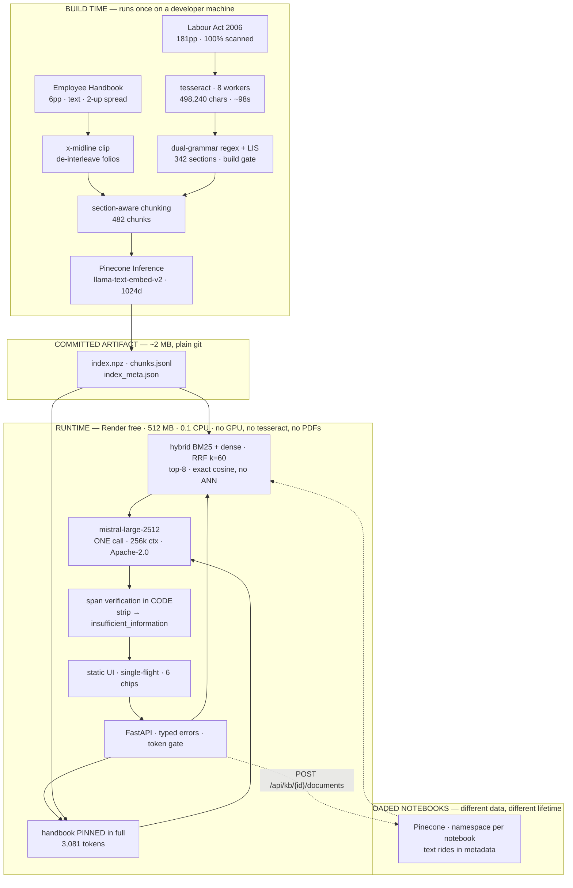

# Enterprise AI Document Assistant

**An HR policy compliance assistant.** Ask a question in plain English; get an answer with the source
document, the printed page number, and a verbatim quote you can check — or an explicit *"not found in
the provided documents."*

**Live:** https://enterprise-ai-document-assistant-8baj.onrender.com
**Stack:** FastAPI · Mistral Large 3 (Apache-2.0) · Pinecone · hybrid BM25 + dense retrieval · **$0/month, no card**

---

## What it does

Two modes, one retrieval core.

**Compliance assistant** (public, no sign-in). It reads a company's Employee Handbook against the
**Bangladesh Labour Act 2006** and answers questions about either — or about the *relationship* between
them:

> **"Does our Employee Handbook comply with the Labour Act on maternity leave?"**
> → *"The Employee Handbook does not appear to address maternity benefit, which s.46 (printed p.39)
> requires at eight weeks preceding and eight weeks following delivery."* — with both sources quoted.

That is a question a search box cannot answer, because the answer is about something that **isn't
there**.

**Notebook mode** (sign-in required). Upload any PDF and chat with it. Scanned documents are OCR'd
automatically. Tested on a corporate handbook, an academic paper, and 1- and 5-page scanned medical
reports including handwritten Bengali.

---

## Why it exists

The corpus is the interesting part. The handbook states on its own first page:

> *"The human resource (HR) policies and procedures contained in this handbook are in compliance with
> the applicable labor laws of Bangladesh."*

The other 181 pages **are that law**. So the corpus is a **falsifiable claim plus its evidence base** —
and the assistant's job is to test the claim. It finds real gaps:

| Topic | Handbook | Labour Act 2006 | Verdict |
|---|---|---|---|
| Casual leave | 10 days | s.115 "ten days" (p.59) | At the floor |
| Sick leave | 14 days | s.116(1) "fourteen days" (p.59) | At the floor |
| Annual leave | 30 days | s.117 ≈ 1 per 18 days worked (p.59) | **Exceeds → compliant** |
| Working hours | 44.5 h/week | s.100 8h→10h, s.102 48h (p.56–57) | Compliant |
| **Maternity** | **0 mentions** | ss.45/46 — **16 weeks** (p.39) | **GAP** |
| **Festival holidays** | 0 (only a *"Festival Bonus"* — a payment) | s.118(1) — **11 paid days** (p.60) | **GAP** |
| **Overtime** | **0 mentions** | s.108 — **2× ordinary rate** (p.57) | **GAP** |
| **Probation carve-out** | *"leave after completion of probation"* | s.115/116 — *"**Every** worker"* | **CONFLICT** |

*(The nuance that matters: s.117 **does** require one year of continuous service, so the probation rule
is lawful for annual leave. It conflicts only for casual and sick.)*

**This is documented gap analysis to support human HR review. It is not legal advice** — and the Act here
is the 2006 text as published in 2009, amended in 2013 and 2018. Every compliance answer opens by naming
that scope.

---

## The problem this actually solves

An LLM asked about your leave policy will invent a plausible answer, because producing plausible text is
all it does. Everything below exists to make that impossible.

**Every claim must quote its source, and code checks the quote against the raw text.** The model never
writes a citation string — it points at a passage and quotes it, and code builds the citation from that
passage's metadata. A claim whose quote doesn't appear in the source is **stripped**. If nothing
survives, the answer becomes *"not found"* — **decided by code, not chosen by the model**.

So a fabricated quote doesn't become a wrong answer. It becomes no answer.

### Why "I don't know" is architecture, not a prompt line

The obvious implementation — refuse when retrieval scores are low — is **measurably wrong here**:

| | question | top-1 similarity |
|---|---|---|
| ✅ answerable | Who is the Chairperson? | **0.179** |
| ✅ answerable | How much overtime pay is required? | **0.224** |
| ❌ **unanswerable** | How many days of **paternity** leave? | **0.413** |

The unanswerable question scores **higher** than two answerable ones, because it collides with the
casual-leave passage. **The distributions invert** — any threshold that refuses paternity also refuses
the Chairperson. That isn't bad luck: a good adversarial question is *plausible*, and plausible means
semantically adjacent. **Retrieval score is an anti-signal for abstention.**

What runs instead is structural:

1. **Handbook silence is provable** — it's pinned in context in full (3,081 tokens), so absence is a
   fact, not a failed search.
2. Every claim cites a retrieved passage; the snippet is **sliced from the source by code**.
3. **Span verification** — the quote must exist in the cited passage, or the claim is dropped.
4. **Statute silence is *bounded*, not proved — and the app says so.** Only the top 8 of 482 passages are
   in context, so *"the Act doesn't address X"* honestly means *"I didn't find it in what I retrieved."*

---

## Measured, not asserted

`python -m evals.harness` — 30 hand-written questions across four tiers, run against the live pipeline
through the app's own rate limiter, so the eval measures the system that actually ships.

| | |
|---|---|
| **recall@5** | **0.81** (n=16 questions with a known governing section) |
| **False-answer rate** | **0.00** — it has never answered something it should have refused |
| **False-refusal rate** | **0.38** — 95% CI **0.21–0.57** (Wilson, n=24) |
| Unanswerable questions | **6/6 correct** |
| Completed | **30/30**, zero rate-limit failures |

**It errs on the safe side, deliberately.** You never see a confident fabrication; you sometimes see
*"not found"* for something the corpus does contain. For a compliance tool, under-answering beats
mis-answering.

**A fix that didn't work, reported anyway.** Many false refusals come from the model quoting text that
*is* in the retrieved context but attributing it to the **wrong passage** — quote true, pointer wrong. I
made the verifier resolve the span across all retrieved passages and build the citation from where the
text actually is. It's correct, and it **did not move the number**: 0.36 before, 0.38 after, with a
confidence interval that swallows both. An intermediate run showed 0.25 and I nearly reported it as a
win — it was noise from a truncated sample.

**The real cause: the corpus is 97% OCR'd and contains real errors.** s.115 literally reads *"casual
leave the full wages"*; s.118 says *"in a calender year"*; s.108 is *"Extra-ailowance"*. The model, being
a careful writer, **corrects them** when quoting — and a corrected quote doesn't exist in the source. The
verifier tolerates one character of drift per long word (`calender`→`calendar` passes) while **numbers
and short tokens must match exactly** (`ten`→`two`, `eleven`→`seven`, `14`→`4` all correctly fail).

**The judge is Gemini, not Mistral** — cross-*family*, not cross-tier. Models score their own family's
output higher, so a Mistral judge grading a Mistral answerer buys insurance that doesn't insure.

**The grep audit runs before any metric.** Every "unanswerable" claim is proved against our own OCR, and
the grep is committed as the test. It caught a question I'd got wrong — I claimed the corpus was silent
on pensions, and `pension` appears **19 times** in the Act. The question was removed rather than the
audit weakened: *an audit you edit to pass is not an audit.*

---

## Architecture



**The line across the middle is the design.** Ingestion is an offline batch pipeline; serving is a
stateless online service. OCR-ing 181 scanned pages on a 0.1-CPU box during a cold start — while a user
waits — would blow the timeout, the memory limit and their patience at once. So it happens once, on a
laptop, and the extracted text is committed. The runtime image contains **no tesseract, no PDFs, no
PyTorch**.

### Measured (`corpus_stats.json`)

| | |
|---|---|
| Corpus | **122,119 tokens** (tekken v13) = **46.6%** of the 262,144 window |
| Index | 482 chunks · 342 sections · **1.97 MB** (1024-dim) |
| OCR | 498,240 chars in **~98s** (8 workers), deterministic |
| Vector search | **0.015 ms** (exact cosine, top-8, local) |
| Query embed | ~500 ms (network) |
| Model call | 1,000–3,000 ms |

Every number in this README is generated by `python -m src.ingest.corpus_stats`. Nothing is quoted from
memory — and a test fails if the docs drift from it.

---

## Engineering notes

The decisions worth defending, and the measurements behind them.

**Why RAG, when the whole corpus fits in one prompt?** It does fit — 46.6% of the window. RAG is a
*choice* here: retrieval accuracy becomes independently measurable, citation provenance is by
construction when a passage carries its own page number, and it survives a corpus that grows. The
full-context baseline is in the eval as the **oracle** — the ceiling retrieval is measured against.

**Why no ANN index?** 482 vectors, exact cosine in **0.015 ms** — a rounding error against a ~500 ms
embedding call and a ~2 s model call. HNSW (`m=16, ef_construction=200, ef_search=64`) earns its place
around 50k vectors, where the exact scan crosses ~10 ms. A distributed ANN index to serve 1.97 MB would
be infrastructure cosplay.

**Why two vector stores?** The axis is **data lifetime, not speed**. The committed corpus is a file in
the image — it loads at boot and can't be broken by anyone else's quota. An uploaded notebook arrives
*after* the image is built, onto a disk the platform wipes, so it needs a database. One `Retriever`
protocol, two backends, both on live traffic. Pinecone gets **one namespace per notebook**, because
isolation that **fails closed** beats a metadata filter you can forget.

**Why no agent?** I planned one — 121 `section N` cross-references looked like multi-hop retrieval. Then
I went looking for a query single-shot actually gets wrong. The canonical example is s.100's eight-hour
cap being *"subject to the provisions of section 108"* — but **the ten-hour exception is in s.100's own
sentence**, and s.108 is the overtime *pay rate*, a different question. Section-aware chunking already
handles it. I couldn't find a failing query, so I wrote no loop.

**Why no reranker?** recall@5 is 0.81 over 482 passages; over-retrieving already surfaces the answer.
Worse, the handbook's leave clause is statutory boilerplate lifted from s.117 — a similarity-maximising
reranker *promotes both near-duplicates*, amplifying the one case where the system most needs to tell
company policy apart from statutory floor.

**Why no fine-tuning?** **I can train it; I can't serve it.** QLoRA on a 7B is ~7 GB and under 30 minutes
on an M2 — that part's easy. But free hosting has no GPU. It also fights the upload feature: a fine-tune
is keyed to one corpus, so every new notebook would be a retrain and a redeploy.

**Embeddings were local, and had to stop being — the most interesting decision here.** They were correct
for the original target, **Hugging Face Spaces at 16 GB**, where onnxruntime's ~280 MB is a rounding
error. Then HF made Docker Spaces PRO-only, the deploy moved to **Render's 512 MB**, and the premise died
without the decision being revisited:

| | baseline | headroom | uploads |
|---|---|---|---|
| with onnxruntime | **370 MB** | 142 MB | **OOM → 502 for everyone** |
| without | **81 MB** | **431 MB** | fine |

An upload needs ~190 MB. No amount of batching fixes a baseline that is 72% of the ceiling — that's
arithmetic, not tuning. **Local compute isn't free when memory is the scarce resource.** The cost of the
change, honestly: ~500 ms per query, and retrieval now depends on Pinecone being up. Retrieval quality
was unchanged.

**Rate limiting took three attempts, each metering the wrong thing.** (1) Requests/second — at 1.0 a storm
of fourteen 429s; at 0.4 with 3s gaps, still 429s, which falsifies the model: the tier meters **tokens**.
(2) Retries — the SDK hardcodes 429 as retryable, so every retry earned another 429 *and fired outside
the limiter*: it admitted 1 request, the API saw 6. (3) An incomplete estimate — the bucket reserved
5,643 tokens against a real prompt of 9,653, spending 1.7× its own budget. Now: **30/30 questions
complete, zero 429s**, paced at ~3 asks/minute, which is what the free tier honestly affords.

---

## API

```
Public
  POST /api/ask                    → {answer, citations[], insufficient_information, route, latency_ms, request_id}
  GET  /health   (GET and HEAD)    → {status, index_loaded, chunk_count, model_id, memory_mb, ...}
  GET  /api/documents              → the curated manifest

Authenticated
  POST   /api/auth/login           → HttpOnly, Secure, SameSite=Lax session cookie
  GET    /api/auth/me              → {authenticated, uploads_persist}
  GET    /api/kb · POST /api/kb · DELETE /api/kb/{id}
  POST   /api/kb/{id}/documents    → 202 + {job_id}
  GET    /api/jobs/{job_id}        → {state, progress, pages, chunks, modality, error}
```

Citations are **typed objects the whole way out, never markdown strings** — you can't write
`assert c.printed_page == 59` against `"— printed p.59 (PDF page 76)"` without a regex. Rendering happens
in the UI from a typed object, so the model **structurally cannot fabricate a page number**.

Typed error envelope, real status codes: **400** malformed · **413** too large · **422** semantic ·
**429** rate limited (echoing upstream `Retry-After`) · **503** unavailable. **A refusal is not an error**
— it's `200 OK` with `insufficient_information: true`, because it's a designed product state. Interactive
docs at `/docs`.

---

## Running it

```bash
python -m venv .venv && source .venv/bin/activate
pip install -r requirements-dev.txt

# Build-time, once. Needs tesseract (brew install tesseract). ~98s on 8 workers.
python -m src.ingest.ocr
python -m src.ingest.build_index      # fails the build if s.46 is missing
python -m src.ingest.corpus_stats     # regenerates every number in this README

cp .env.example .env                  # add MISTRAL_API_KEY, PINECONE_API_KEY
uvicorn src.api.main:app --reload --port 7860
```

**The test suite runs with no API key and no network** — `core/` takes injected `Generator` and `Embedder`
protocols:

```bash
pytest -q          # 68 passed
lint-imports       # proves core/ imports no fastapi, mistralai, pinecone, or mcp
```

### The file worth opening first

[`.importlinter`](.importlinter) — fifteen lines saying `src.core` may not import `fastapi`, `starlette`,
`uvicorn`, `mcp`, `pinecone`, `mistralai`, or a text splitter. It runs in CI **and** in pytest. That's not
style: it's what lets the suite run offline against fakes, why swapping Mistral for self-hosted Apache-2.0
weights is a one-file change, and why exposing retrieval over MCP would be a ~21-line adapter rather than
a refactor.

**It isn't a claim in a README asking to be believed. The build fails if it stops being true.**

### Try the notebook mode

| | |
|---|---|
| Email | `reshad.sazid@gmail.com` |
| Password | `aireshaddocument1234` |

A throwaway demo credential that protects nothing valuable. The server stores only a **bcrypt hash**, in
an environment variable; no plaintext and no hash is in this repo. There's no user table, because there's
one account — a database of one row would be architecture theatre.

⚠️ **Don't upload anything confidential.** These credentials are public, so anything uploaded is reachable
by anyone reading this repo.

---

## Assumptions and limitations

- **The Act is legally stale.** It's the 2006 Act as published by the Bangladesh Employers' Federation in
  **2009**, materially amended in **2013 and 2018** — including in areas this app reasons about. Every
  compliance answer opens by naming that scope. **Not legal advice.**
- **Statute-side absence is bounded, not proved.** Only the top 8 of 482 passages are in context. The
  full-context oracle quantifies the gap; it doesn't eliminate it.
- **False refusals ~0.38.** Measured, CI 0.21–0.57, fails safe. The dominant cause is the model correcting
  the OCR's typos when quoting. **This is the top open problem.**
- **Uploaded notebooks get a weaker pipeline than the built-in corpus, honestly.** The statute gets a
  chunker built on its own section grammar; an arbitrary PDF gets a generic recursive split, because I
  don't know its grammar. So uploaded citations carry a page number but no section anchor, and the app
  says *"the retrieved passages do not cover X"*, never *"the document does not contain X."*
- **Uploads are capped** (3 notebooks, 20 MB, 60 pages) and job records die on restart. Ingestion is
  idempotent on `sha256(bytes)`, so recovery is a re-upload — never a duplicate. Vectors *and* text
  persist in Pinecone, so a notebook survives a restart completely.
- **Free-tier data training.** Mistral's free tier trains on submitted data by default; the opt-out is one
  toggle and it's off here. The durable answer is the model choice: `mistral-large-2512` is **Apache 2.0**,
  so the identical pipeline self-hosts behind a firewall — a one-file change, because `core/` takes an
  injected `Generator`.
- **The service sleeps after 15 minutes idle** (free tier) and takes ~1 min to wake. An uptime monitor
  keeps it warm.
- **The TOC (pp. 2–16) and the ILO annex (pp. 158–181) are deliberately excluded** — dot-leaders shadow
  every real heading, and the annex is a table that OCRs to word salad. A measured, documented exclusion
  beats a half-working table parser.

## Further reading

- [`docs/INTERVIEW_HANDBOOK.md`](docs/INTERVIEW_HANDBOOK.md) — a walkthrough of every design decision from
  first principles.
- [`docs/DECISION_RECORD.md`](docs/DECISION_RECORD.md) — every rejected alternative and the measurement
  that killed it.
- [`IMPLEMENTATION_ROADMAP.md`](IMPLEMENTATION_ROADMAP.md) — the original build plan, kept with its
  corrections visible.
