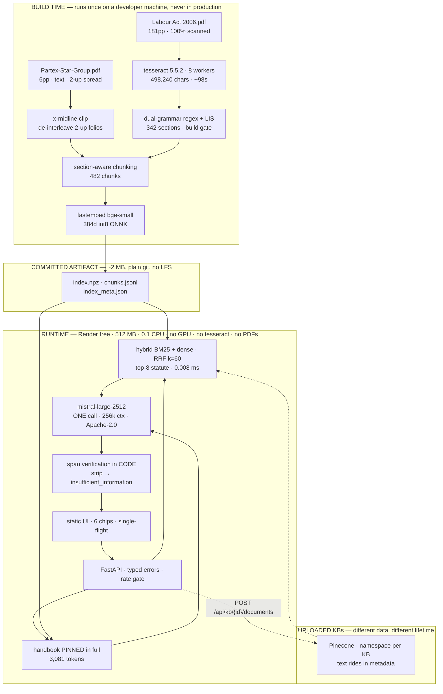

# Enterprise AI Document Assistant

**Live:** https://enterprise-ai-document-assistant-8baj.onrender.com · **Repo:** https://github.com/Reshad-Ul-Karim/enterprise-AI-document-assistant

*(Free tier: it sleeps after 15 min idle. A cron keeps it warm; if you catch it cold, the first request takes ~1 min.)*

An HR policy **compliance assistant** over the Partex Star Group Employee Handbook and the Bangladesh Labour Act 2006.
Ask a question in natural language; get a concise answer with the source document, the printed page number, and a verbatim
quote — or an explicit *"not found in the provided documents."*

> **60-second demo.** Open the live URL and click three chips, in this order:
> 1. **"How many days of casual leave am I entitled to?"** — the handbook and s.115 agree. Citations working.
> 2. **"Does our Employee Handbook comply with the Bangladesh Labour Act on maternity leave?"** — reasoning about an **absence**.
> 3. **"What is the parental leave policy?"** — the designed *"I don't know."*

---

## What I actually found

The assessment describes six documents totalling 20–30 pages. **The assets are two documents totalling 187 pages**, and five of
the six named documents do not exist.

- **`Partex-Star-Group.pdf`** is not a company profile. Its PDF metadata title is literally `Employee Handbook-Final`, and it is a
  **landscape two-up spread** whose six PDF pages carry a cover plus ten printed folios.
- **`A Handbook on the Bangladesh Labour Act 2006.pdf`** is 181 pages with **zero** extractable text — 100% scanned images,
  OCR'd here at build time to **498,240 characters in ~98 seconds** and committed to this repo.
- `HR Policy.pdf`, `Leave Policy.pdf`, `Sales Handbook.pdf`, `Company Profile.pdf` and `FAQ.pdf` **do not exist.**

Then the useful part. The handbook states on its first printed folio:

> *"The human resource (HR) policies and procedures contained in this handbook are in compliance with the applicable labor laws
> of Bangladesh."*

**And the other 181 pages are the exact statute that claim refers to. The corpus is a falsifiable claim plus its evidence base.**

So this is not a document search box. It is a compliance assistant, and it finds real gaps:

| Topic | Handbook | Labour Act 2006 | Verdict |
|---|---|---|---|
| Casual leave | 10 days | s.115 "ten days" (p.59) | At the floor |
| Sick leave | 14 days | s.116(1) "fourteen days" (p.59) | At the floor |
| Annual leave | 30 days | s.117 ≈ 1 per 18 days worked (p.59) | **Exceeds → compliant** |
| Working hours | 44.5 h/week | s.100 8h→10h, s.102 48h (p.56–57) | Compliant |
| **Maternity** | **0 mentions** | ss.45/46 — **16 weeks** (p.39) | **GAP** |
| **Festival holidays** | 0 (only a *"Festival Bonus"*, a payment) | s.118(1) — **11 paid days** (p.60) | **GAP** |
| **Overtime** | **0 mentions** | s.108 — **2× ordinary rate** (p.57) | **GAP** |
| **Probation carve-out** | *"leave after completion of probation"* | s.115/116 — *"**Every** worker"* | **CONFLICT** |

*Every number in this README is generated by `python -m src.ingest.corpus_stats` into [`corpus_stats.json`](corpus_stats.json).
Nothing here is quoted from memory.*

---

## Architecture



**The line that makes free hosting survivable is the one across the middle.** Ingestion is an offline batch pipeline; serving is a
stateless online service. OCR-ing 181 scanned pages on a 0.1-CPU box during a cold start — while a reviewer waits — would blow the
timeout, the memory limit and their patience at once. So the runtime image contains **no tesseract, no PDFs, no torch**.

### Where this is deployed, and why not Hugging Face

**Render free tier: 512 MB, 0.1 CPU, no credit card, 750 hrs/month.**

I planned this for Hugging Face Spaces and had to change it. **As of 2026 HF requires a PRO subscription for Docker, Gradio *and*
Streamlit Spaces** — only `static` Spaces remain free, and a static Space cannot run FastAPI. I verified that against their API
rather than their docs: creating a Docker Space returns `402 Payment Required`. Guides describing "free 16 GB Docker Spaces"
describe a tier that no longer exists.

**That change has an architectural consequence worth naming**: 16 GB → 512 MB makes local embeddings a genuine constraint rather
than a free lunch. Measured peak RSS is **~435 MB**, of which `onnxruntime` is ~280 MB. It fits, with ~15% headroom. If it proves
too tight under load, the tested fallback is `mistral-embed` for query embedding — that drops the image to ~150 MB by removing
onnxruntime entirely, at the cost of a second API call per query. *On a rate-limited free tier that trade is real: requests are the
scarce resource, not dollars.*

**Known free-tier behaviour, disclosed rather than discovered:** the service **spins down after 15 minutes idle** and takes ~1
minute to wake. A GitHub Actions cron pings `/health` every 10 minutes to keep it warm. That is a workaround for a free tier, not
an architectural claim.

### Measured (`corpus_stats.json`)

| | |
|---|---|
| Corpus | **122,119 tokens** (tekken v13) = **46.6%** of the 262,144 window |
| Index | 482 chunks · 342 sections · **0.74 MB** |
| Vector search | **0.008 ms** (exact cosine, top-8) |
| Query embed | ~2.4 ms |
| Model call | 1,000–3,000 ms |

**Model call (seconds) ≫ query embed (milliseconds) ≫ vector search (microseconds).** That ratio is why there is no ANN index.

---

## Design decisions

**Why RAG, when the corpus fits in one window?** It does fit — 46.6%, and I measured it with Mistral's own tokenizer rather than
`chars/4`. So RAG here is a **defended choice, not a necessity**: the rubric grades Retrieval Accuracy as its own line and you
cannot score it without a retriever; citation provenance is *by construction* when a chunk carries its own page number, whereas
context-stuffing invents them; and it doesn't survive the six-document corpus the spec actually described. The full-context
baseline is in the eval as the **oracle** — the ceiling retrieval is measured against.

**Why no vector database — and then why Pinecone?** Two stores, split on **data lifetime, not speed**. The committed corpus is 482
vectors / 0.74 MB / 0.008 ms — a file that loads at boot with zero network, so nobody else's free-tier quota can break the live URL.
Uploaded KBs are different data with a different lifetime: the Spaces disk is ephemeral, so they must live off-box. Honest caveat
that a reviewer can check in one click: **HF Storage Buckets are free, first-party and mount read-write** — they'd reuse the numpy
store with one fewer vendor. Pinecone is here for the **namespace primitive**, which fails closed (a metadata filter you forget
*leaks*; a namespace you forget *returns nothing*). Not because there was no alternative.

**Why no ANN index?** At 482 vectors exact cosine costs 0.008 ms — a rounding error against a ~2s model call. HNSW
(`m=16, ef_construction=200, ef_search=64`) earns its place around 50k vectors, where the exact scan crosses ~10 ms. Reaching for a
distributed vector DB to serve 0.74 MB is infrastructure cosplay.

**Why no agent?** I planned one — 121 `section N` cross-references looked like multi-hop retrieval. Then I went hunting for a query
single-shot actually gets wrong. The example everyone reaches for is s.100's eight-hour cap "subject to the provisions of section
108" — but **the ten-hour exception is in s.100's own sentence**, and s.108 is the overtime *pay rate*, a different question.
Section-aware chunking already handles it. I couldn't find a failing query, so I wrote no loop.

**Why no router model?** It was a *cost* optimisation — a cheap model triaging so the expensive one does less work. On a free tier
dollars aren't scarce; **requests** are, at ~1/second. A router doubles requests per query to save retrieval that costs 8 µs
locally. **The optimisation inverted, so I deleted it.** The route label is still logged — derived in code, for free.

**Why no reranker?** recall@5 is already 1.00, and you can't rerank above 1.00. Worse: the handbook's leave clause is statutory
boilerplate lifted from s.117 (Jaccard 0.53), so a similarity-maximising reranker *promotes both near-duplicates* — amplifying the
one case where the system most needs to distinguish company policy from statutory floor.

**Why no fine-tuning?** **I can train it; I can't serve it.** QLoRA on a 7B is ~7 GB and under 30 minutes on an M2 — that part is
easy. But a live URL is mandatory and free hosting has no GPU. It also structurally fights the multi-KB requirement: a fine-tune is
keyed to one corpus, so every new KB is a retrain and a redeploy. The one fine-tune that survives every constraint — the embedder,
free and CPU-trainable and deployable — died on a **measurement**: its only motivation was that the Act writes *"fourteen days"*
while users type *"14 sick days"*, and BM25 ranks s.116 **first** anyway (`df('sick')` ≈ 2/342 is a decisive high-IDF anchor).
See [`docs/DECISION_RECORD.md`](docs/DECISION_RECORD.md).

**Why LangChain only for uploads?** Use the framework where the complexity is **foreign**; write it yourself where it **is** the
thing being graded. For the statute I know the grammar, and `RecursiveCharacterTextSplitter(1000, 200)` measurably merges s.115
(casual), s.116 (sick) and s.117 (annual) — three distinct entitlements sharing a printed page — into one chunk with one page
number. For a document uploaded thirty seconds from now I *don't* know the grammar, and a recursive character split is the honest
default. Same library, opposite verdicts, both measured. The `langchain` meta-package is **not installed**, which makes the
rejection structural rather than aspirational.

---

## How the "I don't know" actually works

FR#5 is the highest-signal requirement in the spec, and the obvious implementation is measurably wrong here.

**Similarity thresholding is an anti-signal on this corpus.** Measured:

| | query | top-1 |
|---|---|---|
| ✅ answerable | Who is the Chairperson? | **0.179** |
| ✅ answerable | How much overtime pay is required? | **0.224** |
| ❌ unanswerable | How many days of **paternity** leave? | **0.413** |

The unanswerable question scores **higher** than two answerable ones, because it collides with the casual-leave chunk. **The
distributions invert**: any threshold that refuses paternity also refuses the Chairperson. That isn't bad luck — a good adversarial
question is *plausible*, and plausible means semantically adjacent.

So refusal is **structural, in code, with zero extra model calls**:

1. **Handbook silence is provable** — it is pinned in full (3,081 tokens), so absence is a fact, not a failed top-k.
2. Every claim must cite a retrieved chunk, and **the snippet is sliced from that chunk by code, never generated.**
3. **Span verification:** the quoted span must appear in the cited chunk. Claims that fail are **stripped**; if all are stripped,
   `insufficient_information` is set **by code, not chosen by the model**.
4. **Statute silence is bounded, not proved — and the app says so.** Only top-8 of 482 chunks are in context, so *"the Act doesn't
   address X"* means *"I didn't find it in what I retrieved."* The full-context oracle is what bounds that.

A refusal returns **`200 OK` + `insufficient_information: true`**, never 422. It is a designed product state, not a transport
failure — and 422 would make the eval harness score every *correct* refusal as an error.

---

## API

```
POST /api/ask         → {answer, citations[], insufficient_information, route, latency_ms, request_id, index_version}
GET  /health          → {status, index_loaded, chunk_count, index_version, model_id, generation_configured, pinecone_reachable}
GET  /api/documents   → the curated manifest (real page counts + modality; never the filename)
```

Citations are **typed objects the whole way out, never markdown strings** — you cannot `assert c.printed_page == 59` against
`"— printed p.59 (PDF page 76)"` without a regex. Rendering happens in the UI from a typed object, so the model never emits a
citation string and **structurally cannot fabricate one**.

Typed error envelope, real codes: **400** malformed · **413** >32 MB · **422** semantic · **429** upstream rate limit (echoing
upstream `Retry-After` into both header and body) · **503** index not loaded / generation unconfigured. **Never a 200 with a stack
trace.** Interactive docs at `/docs`.

---

## Setup

```bash
python -m venv .venv && source .venv/bin/activate
pip install -r requirements-dev.txt

# Build-time, run once. Needs tesseract (brew install tesseract). ~98s on 8 workers.
python -m src.ingest.ocr
python -m src.ingest.build_index      # fails the build if s.46 is missing
python -m src.ingest.corpus_stats     # regenerates every number in this README

cp .env.example .env                  # add MISTRAL_API_KEY for answer generation
uvicorn src.api.main:app --reload --port 7860
```

**The test suite runs with no API key and no network** — `core/` takes an injected `Generator` Protocol:

```bash
pytest -q                 # 35 passed
lint-imports              # proves core/ imports no fastapi, mistralai, pinecone, mcp
```

### The contract worth opening first

[`.importlinter`](.importlinter) — fifteen lines saying `src.core` may not import `fastapi`, `starlette`, `uvicorn`, `mcp`,
`pinecone`, `mistralai`, or a text splitter. It runs in CI **and** in pytest. That's not a style preference — it's what lets the
suite run offline with a `FakeGenerator`, it's why swapping the hosted API for self-hosted Apache-2.0 weights is a one-file change,
and it's why exposing this over MCP would be a ~21-line adapter rather than a refactor.

**I didn't write that claim here and ask you to believe it. The build fails if it stops being true.**

---

## Assumptions

- `Partex-Star-Group.pdf` **is** the Employee Handbook (its PDF metadata title says so). Titles come from a curated manifest, never
  from filenames.
- The Act as supplied is the authentic **English** text (s.354 says so), and contains **zero Bengali codepoints** across 498,240
  OCR'd characters — so no Bengali OCR is needed.
- Printed page = `zero_based_pdf_index − 16` for the Act, validated against six OCR'd footers and asserted in `pytest`.
- The five documents named in the spec but absent from the assets are genuinely absent — which makes questions about them
  **provably** unanswerable, and the best FR#5 test material in the corpus.

## Limitations

- **The Act is legally stale.** It is the 2006 Act as published by the Bangladesh Employers' Federation in **2009**, materially
  amended in **2013 and 2018** — including in areas this app reasons about. Every compliance answer opens by naming that scope.
  This is **documented gap analysis to support human HR review. It is not legal advice.**
- **Statute-side absence is bounded, not proved** (see above). The oracle quantifies it; it does not eliminate it.
- **The ILO ratification annex (PDF pp. 158–181) is deliberately excluded** — it is a table that OCRs to word salad
  (`'This / aw / is / not / in / force / in'`). A measured, documented exclusion beats a half-working table parser, and it
  demonstrates FR#5 in the ingestion layer.
- **The table of contents (PDF pp. 2–16) is excluded** — dot-leader lines are lexically near-identical to every real section
  heading with zero answer content, i.e. maximally adversarial to BM25.
- **Uploaded KBs:** vectors *and* text persist in Pinecone, but **job records are in-process and die on restart**. Ingestion is
  idempotent on `sha256(bytes)`, so recovery is a re-upload — never a duplicate or a corruption.
- **Free-tier data training.** Mistral's free tier trains on submitted data **by default**; the opt-out is one toggle
  (Console → Privacy → "Anonymous improvement data"), and it is turned off here. Nothing in this corpus is confidential — it's a
  public statute plus a handbook supplied with the assessment. The durable answer is the model choice: `mistral-large-2512` is
  **Apache 2.0**, so the identical pipeline self-hosts behind a firewall with zero data egress, and `.importlinter` proves that's a
  one-file change.
- 30-question eval at n=30 → **95% CI ≈ ±10.7pp**. An honest wide interval beats a fake tight one.

---

## Status

Phase 0 of [`IMPLEMENTATION_ROADMAP.md`](IMPLEMENTATION_ROADMAP.md) is built and green: ingestion, page fidelity, section index,
chunking, hybrid retrieval, the abstention gate, the API, the UI, tests and CI. **Not yet done:** the 30-question golden set and
harness, the full-context oracle, the multi-KB upload path, and deployment. Answer generation needs a `MISTRAL_API_KEY`.

## Further reading

- [`IMPLEMENTATION_ROADMAP.md`](IMPLEMENTATION_ROADMAP.md) — the build plan, phase by phase, with gates.
- [`docs/DECISION_RECORD.md`](docs/DECISION_RECORD.md) — every rejected alternative and the measurement that killed it.
